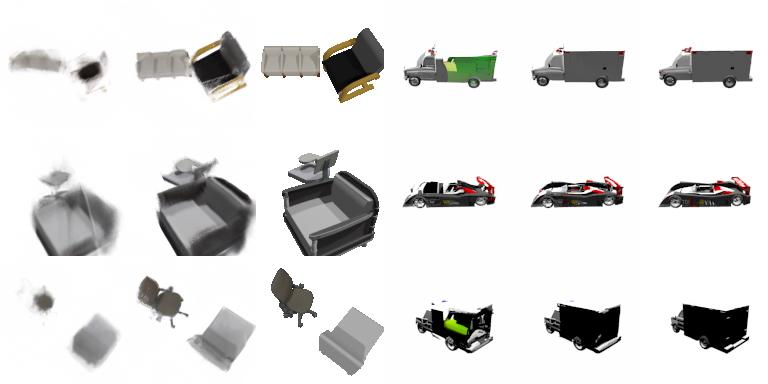

# ViewAttention: Pay Attention to Where You Look

Alex Berian, JhihYang Wu, Daniel Brignac, Natnael Daba, Abhijit Mahalanobis  
University of Arizona



Accepted to ICIP 2025 Workshop of Generative AI for World Simulations and Communications  

arXiv: 

If you only want our implementation of GeNVS, visit https://github.com/JhihYangWu/UnofficialGeNVS and please consider citing our paper.  

Abstract: Novel view synthesis (NVS) has gained significant attention with the advancement of generative modeling techniques. While earlier methods, such as neural radiance fields (NeRF) and Gaussian splatting, have achieved impressive results, the integration of diffusion models has brought NVS closer to generating photorealistic images. Recently, there has been a shift toward few-shot NVS, where only a sparse set of input views are provided to generate novel views from unseen camera poses. Despite this, existing methods typically assume equal importance for all input views relative to the target view, which can lead to suboptimal results, especially when the input views vary significantly in relevance to the target pose. In this work, we focus on improving few-shot NVS by introducing a camera-weighting mechanism that adjusts the importance of source views based on their relevance to the target view. We propose two types of approaches: a deterministic weighting schemes, which account for geometric properties like Euclidean distance and angular differences between the source and target views, and a cross-attention based learning scheme that enables the model to learn optimal view weighting. We apply these techniques to few-shot NVS scenarios, demonstrating that our camera-weighting methods enhance the quality of synthesized views compared to conventional equal-weighting approaches. Our results highlight the potential of view-weighting strategies to improve accuracy and realism in few-shot NVS.

This is the official repository for our paper, ViewAttention.  
Even though we mention GeNVS throughout our code base, it is our implementation of GeNVS (not official) so it may be different from what the authors of GeNVS have. Just like the authors of GeNVS, we built our project on top of [EDM](https://github.com/NVlabs/edm) from Nvidia. Check their repo out to understand what we changed and what we kept the same.  

# Environment setup

Create an environment using conda:
```
conda env create -f environment.yml
conda activate genvs
```

# Logging

To log training progress on wandb, fill in your wandb project information in training/training_loop.py wandb.init(...).

# Data

Pre-rendered ShapeNet cars and multi-chair images from https://drive.google.com/drive/folders/1PsT3uKwqHHD2bEEHkIXB99AlIjtmrEiR, hosted by the authors of pixelNeRF.  

# Pre-trained weights

Download our pre-trained GeNVS weights from 

# Evaluation

All evaluation code is in `genvs/{cars, chairs}/eval/` directory.

# Training

Modify `train.sh` to your liking and run the script to start training.  

Flag definitions can be found in train.py.

# pixelNeRF modifications

We are not publishing our pixelNeRF modifications because we do not want to upload someone else's code with only little modifications. You can easily make the modifications by integrating [cam_weighting.py](./genvs/cars/genvs/models/cam_weighting.py) into pixelNeRF.

# BibTeX

```

```

# Acknowledgements

Our code is built on top of EDM from Nvidia: https://github.com/NVlabs/edm  
Parts of the code were inspired by pixelNeRF: https://github.com/sxyu/pixel-nerf  
Our implementation of GeNVS is based off of: https://nvlabs.github.io/genvs/  
